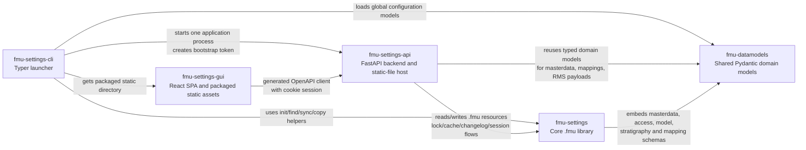
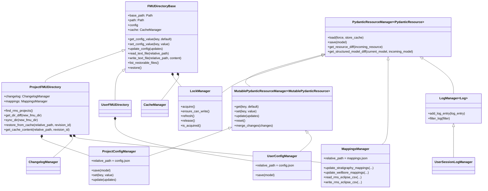
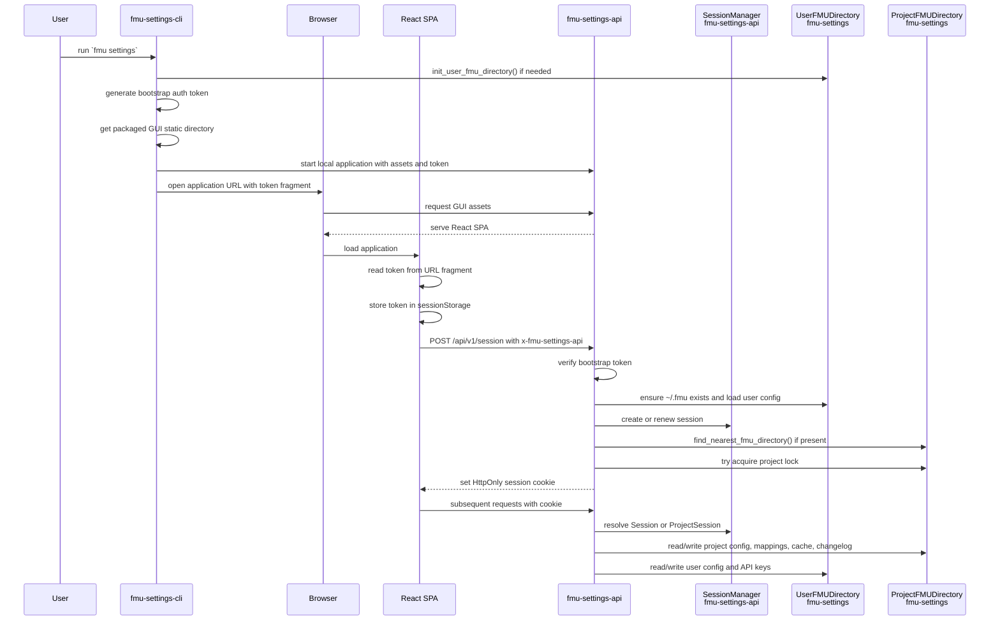

# Architecture

This page describes the architecture owned by this repository and the high-level relationship between `fmu-settings` and the surrounding FMU Settings repositories.

`fmu-settings` is the behavioral core. It reads, writes, and manages resources in project and user `.fmu/` directories, including locking, diffing, caching, restoring, and validation.

## Ecosystem Overview

The dependency chain is intentionally layered:

- [`fmu-settings`](https://github.com/equinor/fmu-settings) reads, writes, and manages the resources stored in `.fmu/` directories.
- [`fmu-datamodels`](https://github.com/equinor/fmu-datamodels) provides the shared vocabulary for masterdata, access, global configuration, and mappings.
- [`fmu-settings-api`](https://github.com/equinor/fmu-settings-api) wraps `fmu-settings` in a session-oriented application layer, coordinates interaction with external systems, and serves the packaged GUI assets.
- [`fmu-settings-gui`](https://github.com/equinor/fmu-settings-gui) builds and packages the React application, which talks to the API and should not edit `.fmu/` files directly.
- [`fmu-settings-cli`](https://github.com/equinor/fmu-settings-cli) is the user-facing command line interface for bootstrapping user state, launching the combined application, and running utility commands.

## Core Library

The main library split is:

- `FMUDirectoryBase` is the filesystem-centered abstraction. It owns the `.fmu` path, lock manager, cache manager, and generic read/write helpers.
- `ProjectFMUDirectory` and `UserFMUDirectory` specialize the base class for project-local `.fmu/` directories and `$HOME/.fmu/`.
- `PydanticResourceManager` is the generic resource engine for loading, saving, diffing, and caching JSON-backed Pydantic models.
- `MutablePydanticResourceManager` adds dot-notation `get`, `set`, `update`, `reset`, and merge behavior for editable resources.
- `ProjectConfigManager`, `UserConfigManager`, `MappingsManager`, and `LogManager` bind specific Pydantic models to managed files inside `.fmu/`.
- Directory objects compose the correct managers and delegate resource operations to them.

## Runtime Flow

The full runtime spans multiple repositories, but `fmu-settings` owns the `.fmu/` directory operations used by the API and CLI.

When a user runs `fmu settings`, `fmu-settings-cli` starts a local application around `fmu-settings`:

1. The CLI ensures the user-level `.fmu/` directory exists, creating `$HOME/.fmu/` through `init_user_fmu_directory()` when needed.
2. It creates a short-lived bootstrap token used only to authenticate the browser session startup.
3. It gets the packaged React static directory from `fmu-settings-gui` and starts one FastAPI/Uvicorn process with the static directory, bootstrap token, and runtime settings.
4. It opens the browser on the local application URL with the bootstrap token in the URL fragment.
5. The React app reads the token from the fragment, stores it in browser session storage, and exchanges it for an API session.
6. The API verifies the bootstrap token, ensures user settings are available, creates or renews a server-side session, and sets an HttpOnly session cookie.
7. If the command was launched from inside an initialized FMU project, the API locates the nearest project `.fmu/` directory and tries to acquire its lock.
8. After session setup, the GUI talks to the API with the session cookie, and the API uses `ProjectFMUDirectory` and `UserFMUDirectory` from `fmu-settings` to read and write managed resources.

